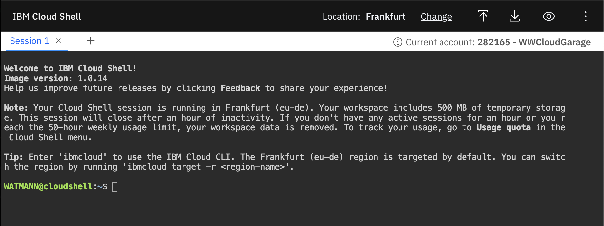

# Lab 2: IBM Cloud + IKS connectivity check

## Prerequisites

This set of instructions requires that you have

- Access to an existing IBM Cloud Account
- Access permissions for an IKS cluster (IBM Cloud Kubernetes Service)

## Login to IBM Cloud via UI

The easiest way to configure access to an existing IKS cluster on IBM Cloud is to follow the instructions in the IBM Cloud UI. Login via the browser **https://cloud.ibm.com** and navigate to **Navigation (aka Burger) Menu -> Kubernetes -> Clusters** . Select the bootcamp cluster provided to you and navigate to the **Access** tab in the IKS cluster details view.

## Leveraging IBM Cloud Shell

In case you do not have sufficient local permissions to install IBM Cloud + Kubernetes CLI on your local machine, or you have issues in your proxy / networking configuration you can also leverage **IBM Cloud Shell** instead.


If you select the IBM Cloud Shell button right beside the Account selector a CLI environment already connected with your IBM Cloud account is created for you.



## Connect to IKS cluster

Above steps guide you to download the cluster configuration and display the kubectl configuration.

- Download the IKS cluster configuration (`ibmcloud ks cluster config --cluster <cluster-id>`)
- Display the current kubectl configuration (`kubectl config current-context`)

Try to execute `kubectl get nodes` to access details about the Kubernetes Worker Nodes you have access to.

```bash
$ kubectl get nodes
NAME             STATUS   ROLES    AGE     VERSION
10.134.237.212   Ready    <none>   3h18m   v1.17.11+IKS
10.134.237.244   Ready    <none>   3h18m   v1.17.11+IKS
10.134.237.245   Ready    <none>   3h19m   v1.17.11+IKS
```

**Very good - now you can execute kubectl commands against your Kubernetes cluster**
