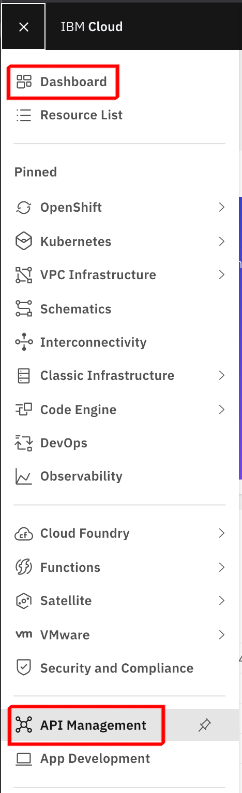
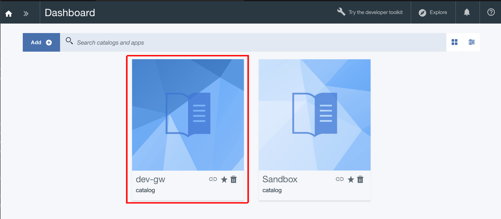

# Lab: Accessing API Connect on IBM Cloud

## Prerequisites

- Access to IBM Cloud and our shared API Connect instance

## Supporting Information

- Navigate to your API Connect Instance through IBM Cloud -> Dashboard -> API Management

## Challenges to be solved

Create a new API Catalog called 'dev-yourinitials' within the API Connect Instance.

## Verification

On the dashboard of API Connect you should see your created catalog. Excellent, we ensured that you have access and sufficient permissions to work with our API Connect instance.

