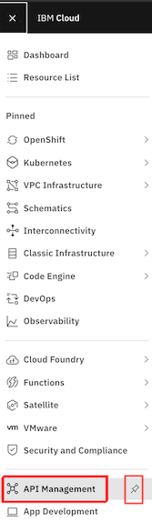

# Lab: Accessing API Connect on IBM Cloud

## Prerequisites

Access to our provided IBM Cloud account plus the shared API Connect instance.

## Supporting Information

Navigate to our API Connect Instance via IBM Cloud -> "Navigation Menu (top left) -> API Management. Use the pin button to move the menu entry upwards for easier accessiblity.

Then select the '\*-bootcamp-apic' API Connect service to navigate to the API Connect Dashboard.

## Challenges to be solved

Create a new API Catalog called 'dev-yourinitials' within the API Connect Instance by just adding it from the Dashboard.

## Verification

On the dashboard of API Connect you should see your created catalog.

Excellent, we ensured that you have access and sufficient permissions to work with our API Connect instance.
