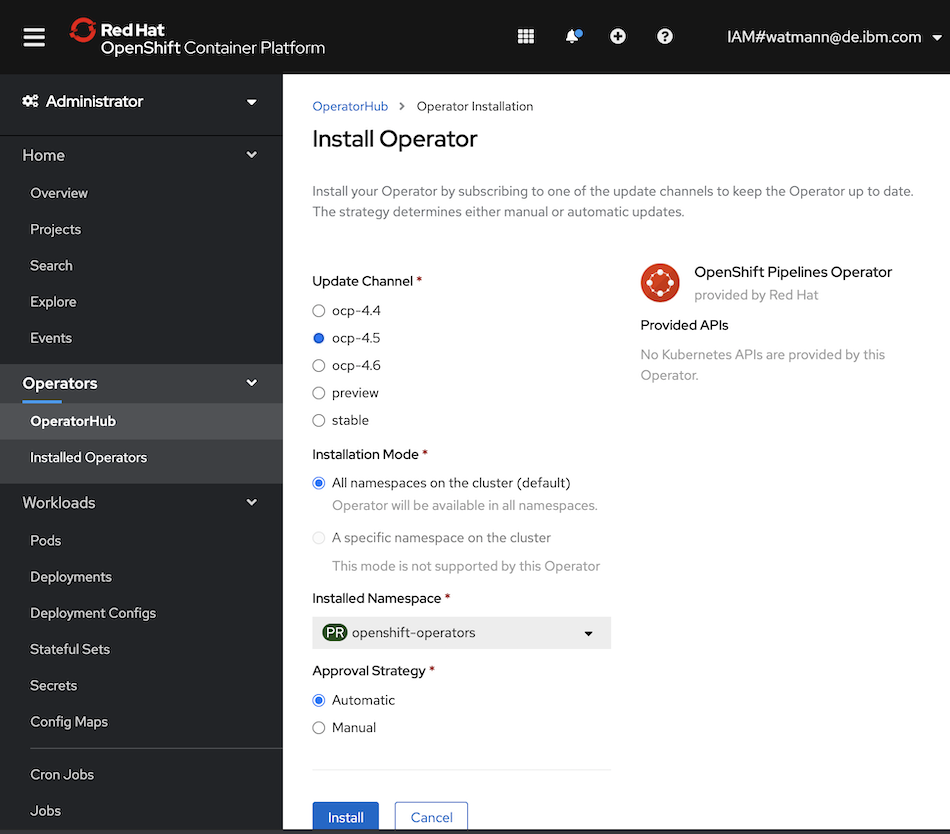
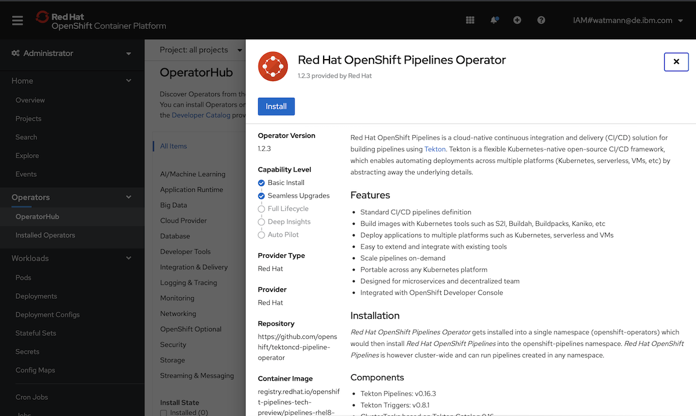
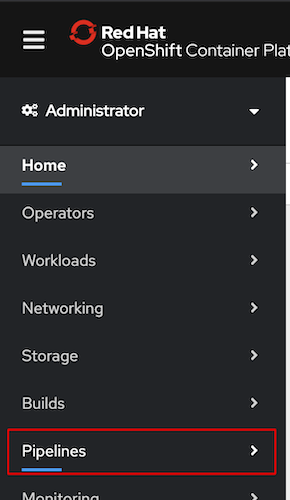

# Tekton / OpenShift Pipelines + ArgoCD on OpenShift

## Setting Up Tekton / OpenShift Pipelines on IBM ROKS

### Install the OpenShift Pipelines Operator

Install the OpenShift Pipeline Operator from within the Operator Hub. Choose the appropriate channel.


We are leveraging version 1.2.3 here.


If the Pipelines view is visible in the OpenShift navigation the initial install did work out.


## Setting Up ArgoCD on OpenShift 4.5 on IBM ROKS

### Create Project namespace

```bash
oc create namespace argocd
oc project argocd
```

### Apply the ArgoCD Manifest on OpenShift (ArgoCD 1.8.3)

```bash
wget https://raw.githubusercontent.com/argoproj/argo-cd/stable/manifests/install.yaml
oc apply -n argocd -f ./install.yaml

oc get pods -n argocd
oc get pods -l=app.kubernetes.io/name=argocd-dex-server -n argocd
```

### Step 3: Get the ArgoCD Server password

```bash
ARGOCD_SERVER_PASSWORD=$(oc -n argocd get pod -l "app.kubernetes.io/name=argocd-server" -o jsonpath='{.items[*].metadata.name}')

echo $ARGOCD_SERVER_PASSWORD
```

### Step 4: Expose ArgoCD Server using OpenShift Route

```bash
oc -n argocd patch deployment argocd-server -p '{"spec":{"template":{"spec":{"$setElementOrder/containers":[{"name":"argocd-server"}],"containers":[{"command":["argocd-server","--insecure","--staticassets","/shared/app"],"name":"argocd-server"}]}}}}'

oc -n argocd create route edge argocd-server --service=argocd-server --port=http --insecure-policy=Redirect
oc get route -n argocd

echo https://$(oc get routes argocd-server -o=jsonpath='{ .spec.host }')
```

### Step 5: Recreate Admin Passwords after setting up TLS connectivity if regular login does not work

1. Remove key admin.password and admin.passwordMtime from argo-cd-secret
2. Scale deployment to 0, then up to 1 again to recreate the secret keys

### Step 6: Login with Argo CD CLI

```bash
ARGOCD_ROUTE=$(oc -n argocd get route argocd-server -o jsonpath='{.spec.host}')
ARGOCD_SERVER_PASSWORD=$(oc -n argocd get pod -l "app.kubernetes.io/name=argocd-server" -o jsonpath='{.items[*].metadata.name}')

argocd --grpc-web login ${ARGOCD_ROUTE} --username admin --password ${ARGOCD_SERVER_PASSWORD}
argocd --grpc-web --server ${ARGOCD_ROUTE} account update-password --current-password ${ARGOCD_SERVER_PASSWORD} --new-password <yournewpassword>
```
