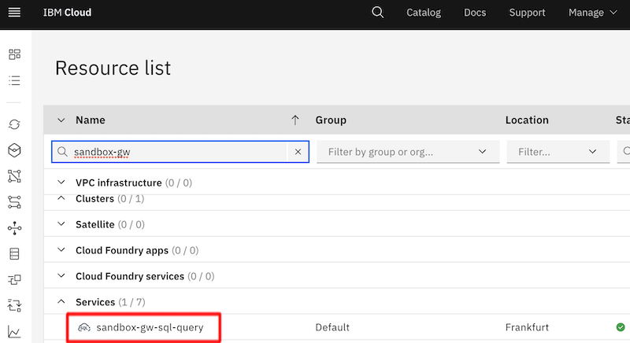
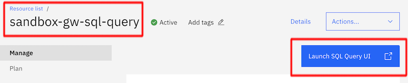

# Lab: Using IBM Cloud Object Storage

## Prerequisites

You have access to an instance of IBM Cloud Object Storage and IBM SQL Query.

Leverage the Covid-19 distribution data set (in CSV format) provided in the **/covid-data-set** folder of this GitHub repository (its from https://www.ecdc.europa.eu/en) with some minor changes on the column names for convenience.

## Challenges to be solved

### Create two custom buckets in the shared Cloud Object Storage instance

Create two Buckets called **dev-yourinitials-bucket** and **dev-yourinitials-results-bucket** in the existing IBM Cloud Object Storage instance. Discover the available options, but change only bucket name, keep the regional setting closest to you and also keep the Smart Tier default storage class.


Select the newly created bucket and upload the data set simple per drag'n'drop into your bucket


### Create your own SQL Query service instance and work with the data from your COS bucket

Create your own SQL Query instance so that you can work independently on your COS data exploration.


Launch your SQL Query instance from the resource list and gain some insights about the the Covid-19 distribution in your country.





Hereby a few examples:

```sql
SELECT * FROM DESCRIBE(cos://eu-de/dev-yourinitials-bucket) INTO cos://eu-de/dev-yourinitials-results-bucket

SELECT DISTINCT countriesAndTerritories FROM cos://eu-de/dev-yourinitials-bucket ORDER BY countriesAndTerritories INTO cos://eu-de/dev-yourinitials-results-bucket

SELECT * from cos://eu-de/dev-yourinitials-bucket where countriesAndTerritories = 'yourcountry'

SELECT countriesAndTerritories, year_week, cases_weekly, deaths_weekly, rate_by_population from cos://eu-de/dev-yourinitials-bucket where countriesAndTerritories = 'yourcountry'
```

## Verification

Find out the five weeks (column 'year_week') in which there has been the highest rate of Covid-19 notifications in 14 days by 100.000 people (column 'rate_by_population') in your country.

As second step: If you want to manage your COS buckets in a file manager you can use any S3 API compatible tool.

This link describes the setup process with Cyberduck which is a good option.
https://cloud.ibm.com/docs/cloud-object-storage?topic=cloud-object-storage-cyberduck .

First you have to retrieve the hmac credentials from your Cloud Object Storage instance.


The "cos_hmac_keys" are the relevant parts of the credentials you have to use.

```json
"cos_hmac_keys": {
    "access_key_id": "",
    "secret_access_key": ""
  }
```

In your Cyberduck connection configuration you take these credentials to authenticate. The server URL depends on your region. For eu-de we will use https://s3.eu-de.cloud-object-storage.appdomain.cloud.


This parameter combination should give you access to your created buckets and provide you with a convenient file manager like interface into the shared IBM Cloud Object Storage instance.

