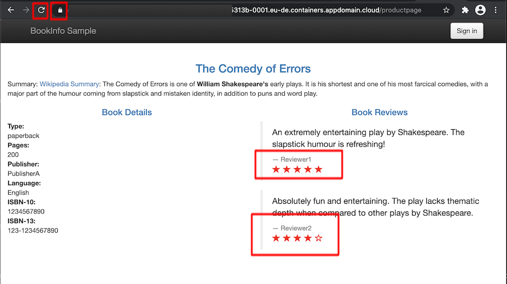

# Lab: Istio Lab 1 - Deploying the Istio BookInfo application

## Prerequisites

Make sure everytime you create resources that you

- target the right Kubernetes cluster
- target the right Kubernetes namespace and set it into your kubectl context

```bash
ibmcloud ks cluster config --cluster **kubeclusterid**
kubectl config set-context --current --namespace=dev-**yourinitials**
```

The Istio plugin is enabled on the shared IKS Cluster.

** Important note: This lab cannot be run concurrently on the same istio ingress controller - clean up your namespace before you run the same lab on the same istio ingress controller **

## Challenges to be solved

### Deploy the Book Info Sample

Create a new namespace called dev-istio-yourinitials and switch to that context.

```bash
kubectl create namespace kubectl create namespace dev-istio-yourinitials
kubectl config set-context --current --namespace=dev-istio-yourinitials
```

Download the latest Istio package, which includes the configuration files for the BookInfo app.

```bash
curl -L https://istio.io/downloadIstio | ISTIO_VERSION=1.8.2 sh -
```

Navigate to the Istio package directory.

```bash
cd istio-1.8.2
```

Linux and macOS users: Add the istioctl client to your PATH system variable.

```bash
export PATH=$PWD/bin:$PATH
```

Label the default namespace for automatic sidecar injection. Any new pods that are deployed to default are now automatically created with Envoy proxy sidecar containers.

```bash
kubectl label namespace dev-istio-yourinitials istio-injection=enabled
```

Deploy the BookInfo application which contains the deployments, service accounts and services.

```bash
kubectl apply -f samples/bookinfo/platform/kube/bookinfo.yaml
```

Ensure that the BookInfo microservices pods are Running.

```bash
kubectl get pods
```

Now we have to add the specific Istio resources, we will first start with the plain HTTP Istio Gateway provided in the samples.

```yaml
apiVersion: networking.istio.io/v1alpha3
kind: Gateway
metadata:
  name: bookinfo-gateway
spec:
  selector:
    istio: ingressgateway # use istio default controller
  servers:
    - port:
        number: 80
        name: http
        protocol: HTTP
      hosts:
        - "*"
```

Next is the Istio VirtualService that we have to adopt to be able to use the same Gateway. Make sure to use **yourinitials** in the prefix section.

```yaml
apiVersion: networking.istio.io/v1alpha3
kind: VirtualService
metadata:
  name: bookinfo
spec:
  hosts:
    - "*"
  gateways:
    - bookinfo-gateway
  http:
    - match:
        - uri:
            exact: /productpage
        - uri:
            prefix: /static
        - uri:
            exact: /login
        - uri:
            exact: /logout
        - uri:
            prefix: /api/v1/products
      route:
        - destination:
            host: productpage
            port:
              number: 9080
```

As the last step deploy the Istio Destination Rules.

```bash
kubectl apply -f samples/bookinfo/networking/destination-rule-all.yaml
```

### Retrieve the public address for the istio-ingressgateway load balancer that exposes BookInfo

Set the Istio ingress IP address as an environment variable.

```bash
export INGRESS_IP=$(kubectl -n istio-system get service istio-ingressgateway -o jsonpath='{.status.loadBalancer.ingress[0].ip}')
```

Set the Istio ingress port as an environment variable.

```bash
export INGRESS_PORT=$(kubectl -n istio-system get service istio-ingressgateway -o jsonpath='{.spec.ports[?(@.name=="http2")].port}')
```

Create a GATEWAY_URL environment variable that uses the Istio ingress host and port.

```bash
export GATEWAY_URL=$INGRESS_IP:$INGRESS_PORT
```

Curl the GATEWAY_URL variable to check that the BookInfo app is running. A 200 response means that the BookInfo app is running properly with Istio.

```bash
curl -o /dev/null -s -w "%{http_code}\n" http://${GATEWAY_URL}/productpage
```

View the BookInfo web page in a browser.

```bash
open http://$GATEWAY_URL/productpage
```

## Verification

Try refreshing the page several times. Different versions of the reviews section round-robin through no stars (v1 of reviews), black stars (v2), and red stars (v3). Validate that you work on a secure TLS connection.



See also: https://cloud.ibm.com/docs/containers?topic=containers-istio-mesh#istio_bookinfo_understanding
