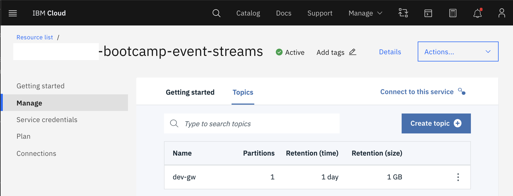
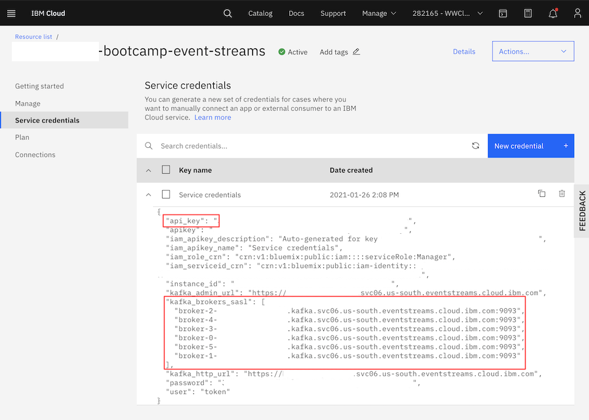

# Lab 8: Connect to a Kafka (Event Streams) instance on IBM Cloud

## Prerequisites

- Access to IBM Cloud and a Kafka instance (on IBM Cloud aka Event Streams)
- Leveraging IBM Cloud Shell if you don't have local Java 1.8/Gradle/Git

## Challenges to be solved

### Create a custom topic

You have to create a Kafka topic named dev-**yourinitials** on our shared Event Streams instance with the following characteristics:

- 1 partition
- 1 day data retention



### Get access credentials for the shared cluster

To be able to access this created topic you have to retrieve an **API key** and your **Kafka endpoints**.
We have created one set of service credentials you can leverage for your tests. These can be found in the credentials section within the
Event Streams service instance ("apikey" and "kafka_brokers_sasl").



### Produce and consume events

You will use the kafka-java-console-sample from https://github.com/ibm-messaging/event-streams-samples/ to produce and consume events.
Probably most of you will use IBM Cloud Shell for this that has all the required tools already installed (gradle, git, java 8).

Retrieve the code with your Git client and build it with gradle.

```bash
git clone https://github.com/ibm-messaging/event-streams-samples/
cd event-streams-samples/kafka-java-console-sample
gradle clean && gradle build
```

Produce some Kafka events to your custom topic and cancel the process after a while.

```bash
java -jar ./build/libs/kafka-java-console-sample-2.0.jar <kafka_brokers_sasl> <api_key> -producer -topic <dev-yourinitials>

[2021-01-26 16:54:03,500] INFO Creating the topic dev-gw (com.eventstreams.samples.EventStreamsConsoleSample)
[2021-01-26 16:54:07,135] INFO Topic dev-gw already exists (com.eventstreams.samples.EventStreamsConsoleSample)
[2021-01-26 16:54:08,268] INFO [Partition(topic = dev-gw, partition = 0, leader = 0, replicas = [0,4,2], isr = [0,4,2], offlineReplicas = [])] (com.eventstreams.samples.ProducerRunnable)
[2021-01-26 16:54:08,268] INFO EventStreamsConsoleSample will run until interrupted. (com.eventstreams.samples.EventStreamsConsoleSample)
[2021-01-26 16:54:08,268] INFO class com.eventstreams.samples.ProducerRunnable is starting. (com.eventstreams.samples.ProducerRunnable)
[2021-01-26 16:54:09,496] INFO Message produced, offset: 943 (com.eventstreams.samples.ProducerRunnable)
[2021-01-26 16:54:11,629] INFO Message produced, offset: 944 (com.eventstreams.samples.ProducerRunnable)
[2021-01-26 16:54:13,766] INFO Message produced, offset: 945 (com.eventstreams.samples.ProducerRunnable)
```

Then consume those Kafka events from your custom topic.

```bash
java -jar ./build/libs/kafka-java-console-sample-2.0.jar <kafka_brokers_sasl> <api_key> -consumer -topic <dev-yourinitials>

2021-01-26 16:56:24,338] INFO Creating the topic dev-gw (com.eventstreams.samples.EventStreamsConsoleSample)
[2021-01-26 16:56:27,014] INFO Topic dev-gw already exists (com.eventstreams.samples.EventStreamsConsoleSample)
[2021-01-26 16:56:28,143] INFO [Partition(topic = dev-gw, partition = 0, leader = 0, replicas = [0,4,2], isr = [0,4,2], offlineReplicas = [])] (com.eventstreams.samples.ConsumerRunnable)
[2021-01-26 16:56:28,143] INFO EventStreamsConsoleSample will run until interrupted. (com.eventstreams.samples.EventStreamsConsoleSample)
[2021-01-26 16:56:28,143] INFO class com.eventstreams.samples.ConsumerRunnable is starting. (com.eventstreams.samples.ConsumerRunnable)
[2021-01-26 16:56:33,190] INFO No messages consumed (com.eventstreams.samples.ConsumerRunnable)
[2021-01-26 16:56:36,191] INFO No messages consumed (com.eventstreams.samples.ConsumerRunnable)
[2021-01-26 16:56:39,191] INFO No messages consumed (com.eventstreams.samples.ConsumerRunnable)
[2021-01-26 16:56:40,666] INFO Message consumed: ConsumerRecord(topic = dev-gw, partition = 0, leaderEpoch = 0, offset = 943, CreateTime = 1611680048274, serialized key size = 3, serialized value size = 57, headers = RecordHeaders(headers = [], isReadOnly = false), key = key, value = {"message":"This is a test message #","message number":0}) (com.eventstreams.samples.ConsumerRunnable)
[2021-01-26 16:56:40,666] INFO Message consumed: ConsumerRecord(topic = dev-gw, partition = 0, leaderEpoch = 0, offset = 944, CreateTime = 1611680051497, serialized key size = 3, serialized value size = 57, headers = RecordHeaders(headers = [], isReadOnly = false), key = key, value = {"message":"This is a test message #","message number":1}) (com.eventstreams.samples.ConsumerRunnable)
[2021-01-26 16:56:40,666] INFO Message consumed: ConsumerRecord(topic = dev-gw, partition = 0, leaderEpoch = 0, offset = 945, CreateTime = 1611680053629, serialized key size = 3, serialized value size = 57, headers = RecordHeaders(headers = [], isReadOnly = false), key = key, value = {"message":"This is a test message #","message number":2}) (com.eventstreams.samples.ConsumerRunnable)
```

## Verification

If you can produce Kafka events to the shared Event Streams instance and can also consume then, you are all set. Also take a second look that the offsets do match (in this sample 943, 944, 945).
