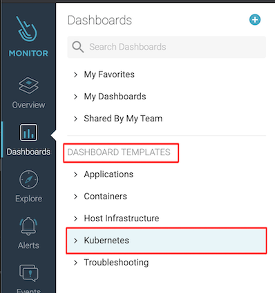

# Lab: Using Sysdig for Kubernetes Service Monitoring

## Prerequisites

- Access to IBM Cloud
- Connected with Kubernetes cluster with attached Sysdig instance
- Curl or some equivalent tool to produce HTTP requests (e.g. postman or similar)
- Assumption here is that most of you will use IBM Cloud Shell due to networking restrictions.

Make sure everytime you create resources that you

- target the right Kubernetes cluster
- target the right Kubernetes namespace and set it into your kubectl context

```bash
ibmcloud ks cluster config --cluster **kubeclusterid**
kubectl config set-context --current --namespace=dev-**yourinitials**
```

## Supporting Information

https://cloudnative101.dev/electives/monitoring/sysdig/
https://cloudnative101.dev/electives/monitoring/sysdig/activities/dashboards/
https://cloudnative101.dev/electives/monitoring/sysdig/activities/alerts/

## Challenges to be solved

### Create the test deployment

Create the following test deployment along with the service definition in your namespace.

```bash
$ kubectl -n dev-yourinitials create deployment yourinitials-web-app --image=docker.io/kennethreitz/httpbin
$ kubectl -n dev-yourinitials create svc nodeport yourinitials-web-app --tcp=8080:80
```

### Add a port mapping

Create a port mapping to run local curl requests, so that we can produce application metrics data.

```bash
$ kubectl -n dev-yourinitials port-forward service/yourinitials-web-app 8080:8080
```

Bring the port-forwarding kubectl command in the background with pressing **CTRL-Z** and then typing **bg** .

### Start creating requests

```bash
$ while true; do sleep 1; curl http://localhost:8080/status/200 -si | head -1 ; done
```

Be patient, it can take a few minutes until the first metrics data flows into our shared Sysdig instance for the first time.

### Create a custom Sysdig Dashboard (based on Kubernetes Service Golden Signal template)

1. Navigate to the Kubernetes Service Golden Signal default template
   

2. Create a new Custom Dashboard based on this template called "yourinitials - Kubernetes Service Golden Signals" .
   

3. Scope it down to your namespace dev-yourinitials and your deployment yourinitials-web-app.
   

### Create an email notification channel

1. Create an email notification channel called "gw-sysdig-channel"

2. Create a custom high severity metric alert with the following characteristics:

- Name: [gw Web Service] HTTP Errors
- Metric: Sum of net.http.error.count
- Scope: Use kubernetes.namespace.name + kubernetes.service.name
- Trigger: if metric > 1 for the last 1 minute in average send a single alert
- Activate your created email notification channel for this alert

### Fire fake HTTP 500 errors

Create additional HTTP 500 errors with beyond additional curl requests.

```bash
while true; do sleep 0.1; curl http://localhost:8080/status/500 -si | head -1 ; done
```

## Verification

You should receive an inital test alert email from Sysdig + the alert email about the HTTP 500 errors. Don't forget to deactivate the alert after your tests.
